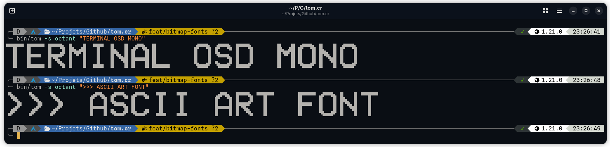
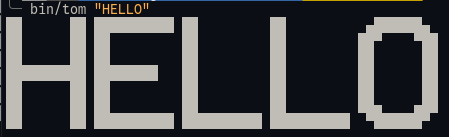
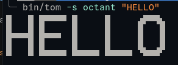
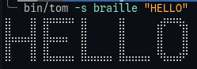

# tom



Tom _(Terminal On-screen display Mono)_ is a tool that allows to display the VCR OSD mono-like font on your terminal.

## Installation

You can install the program via the [GitHub relases](https://github.com/tamdaz/tom.cr/releases), or via:

```sh
shards install
```

## Usage

```
Usage: tom [options] TEXT
    -s NAME, --style=NAME            Block characters to draw with: half, octant, braille (default: half)
    -v LETTER:N,..., --variant=LETTER:N,...
                                     Use glyph variant N for a given letter, e.g. S:2 (repeatable)
    -h, --help                       Show this help
```

```sh
tom HELLO
```



Three block styles are available via `-s`, all built from the same glyph data
so letter spacing stays the same width on screen whatever style you pick:

| Style                | Cell size    | Looks like                          |
| -------------------- | ------------ | ----------------------------------- |
| `half` _(default)_   | 1x2 pixels   | classic half blocks (`▀` `▄` `█`)   |
| `octant`             | 2x4 pixels   | finer, Unicode 16 block octants     |
| `braille`            | 2x4 pixels   | finest, Braille patterns            |

```sh
tom -s octant HELLO
```





Characters that use braille characters might depend on your terminal. Some of them might not display as well.

## Development

```sh
crystal spec
shards build tom
```

Glyphs live one ASCII code per directory, as half-block art: `src/data/<code>/<variant>.txt` _(e.g. `src/data/65/1.txt` for `A`, variant 1)_. Each file is a 10x7 grid drawn with `▀`, `▄`, `█` and spaces — octant and braille output are derived from this at render time.

## Contributing

1. Fork it (<https://github.com/tamdaz/tom.cr/fork>)
2. Create your feature branch (`git checkout -b my-new-feature`)
3. Commit your changes (`git commit -am 'Add some feature'`)
4. Push to the branch (`git push origin my-new-feature`)
5. Create a new Pull Request

## Contributors

- [Zohir Tamda](https://github.com/tamdaz) - creator and maintainer
